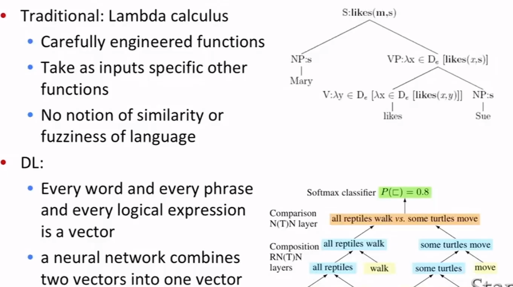

# Lecture 1

## What is NLP? The nature of human language

**What is NLP?**

* **Natural language processing** is a field at the intersection of
  * computer science
  * artificial intelligence
  * and linguistics
* **Goal**: for computers to process or "understand" natural language in order to perform tasks that are useful,e.g.,
  * Performing Tasks, like making appointments, buying things
  * Question Answering
* Fully **understanding and representing** the **meaning** of language(or even defining it) is a difficult goal.
  * Perfect language understanding is AI-complete

**NLP Levels**

**(A tiny sample of) NLP Applications**

Applications range from simple to complex:

* Spell checking, keyword search, finding synonyms
* Extracting information from websites such as
  * product price, dates, location, people or company names
* Classifying: reading level of school texts, positive/negative sentiment of longer documents
* Machine translation
* Spoken dialog systems
* Complex question answering

**NLP in industry ... is taking off**

* Search(written and spoken)
* Online advertisement matching
* Automated/assisted translation
* Sentiment analysis for marketing or finance/trading
* Speech recognition
* Chatbots/ Dialog agents

**What's special about human language?**

A human language is a system **specifically constructed to convey the speaker/writer's meaning**

A human language is a **symbolic/categorical signaling system**

## What is Deep Learning

**What is DL?**

* Deep learning is a subfield of machine learning
* Most machine learning methods work well because of **human-designed representations** and **input features**.
* Machine learning becomes just optimizing weights to best make a final prediction.

Machine Learning

> human beings working out how to describe data and work out important features(90%). And only sort of 10% the computer running this learning.

Deep Learning

* **Representation learning** attempts to automatically learn good features or representations.
* **Deep Learning** algorithm attempt to learn (multiple levels of) representation and an output.
* From "raw" inputs x

PS:

* In ~2010 deep learning techniques started outperforming other machine learning techniques. Why this decade?

  * Large amounts of training data favor deep learning

  * Faster machines and multicore CPU/GPUs favor Deep Learning

  * New models, algorithms, ideas

    > Better, more flexible learning of intermediate representations
    >
    > Effective end-to-end joint system learning
    >
    > Effective learning methods for using contexts and transferring between tasks

## Why is language understanding difficult

ambiguous

## Deep NLP = Deep Learning + NLP

Combine ideas and goals of NLP with using representation learning and deep learning methods to solve them

Several big improvements in recent years in NLP with different

* **Levels**: speech, words, syntax, semantics
* **Tools**: parts-of-speech, entities, parsing
* **Applications**: machine translation, sentiment analysis, dialogue agents, question answering

## Intro to the application of Deep Learning to NLP

**Representations of NLP Levels: Morphology**

NLP Tools: Parsing for sentence structure

**Representations of NLP Levels: Semantics**

NLP Applications: Sentiment Analysis

