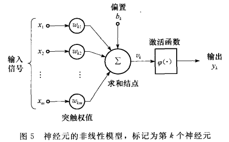
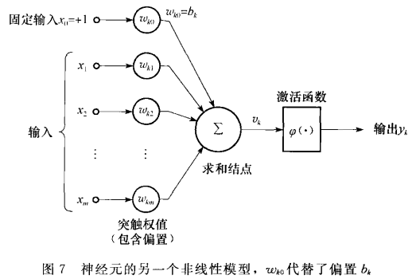
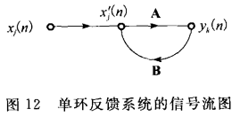

# 1 什么是神经网络

神经网络： 由简单处理单元构成的大规模并行分布式处理器，天然地具有存储经验知识和使之可用的特性。 

1. 神经网络通过学习过程从外界环境中获取知识 
2. 互连神经元的连接强度，即突触权值，用于存储获取的知识 

 

学习算法： 用于完成学习过程的程序 

1. 以有序的方式改变网络的突触权值以获得想要的设计目标 

# 3 神经元模型

神经元：神经网络操作的基本信息处理单位。 

三种基本元素：突触、加法器、激活函数 

# 5 反馈

单环反馈系统的信号流图：

公式推导：
$$
y_k(n)=\bold{A}[x_j' (n)] \\
x_i'(n)=x_j(n)+\bold{B}[y_k(n)] \\
上式化简： y_k(n) = \frac{\bold{A}}{1-\bold{AB}}[x_j(n)] \\
又 \frac{\bold{A}}{1-\bold{AB}}[x_j(n)]=\frac{w}{1-wz^{-1}}=w(1-wz^{-1})^{-1} \\
可知：\frac{\bold{A}}{1-\bold{AB}} = w \sum_{l=0}^\inf w^lz^{-l} \\
从而推出：y_k(n) =  w \sum_{l=0}^\inf w^lz^{-l}[x_j(n)]\\
由算子z^{-l}定义：z^{-l}[x_j(n)] = x_j(n-l)\\
输出可表示为：y_k(n) =  w \sum_{l=0}^\inf w^lx_j(n-l)
$$

# 6 网络结构

1. 单层前馈网络 

   > 源节点构成输入层，直接投射到神经元输出层，反之亦不然。这个网络式严格前馈的。 

 

2. 多层前馈网络 

   > 在1的基础上多了一层或多层隐藏层。
   >
   > 可称为：m-h1-h2-q网络（输入m,隐藏层1有h1个神经元，隐藏层2有h2个神经元，输入q） 

 

3. 递归网络 

   > 与前馈网络的区别在于它至少有一个反馈环。 

# 7 知识表示

主要特征： 

1. 什么信息是明确表述的 
2. 物理上信息是如何被编码和使用的 

 

有关世界的知识由两类信息组成： 

1. 先验信息：由“什么是”事实和“什么是已知道的”事实所表示； 
2. 对世界的观察（测量）：神经网络中被设计用于探测环境的传感器获得。 

 

怎样在神经网络设计中加入先验信息： 

1. 通过使用称为接受域（receptive field）的局部连接，限制网络结构； 
2. 通过使用权值共享（weight-sharing），限制突触权值的选择。（能使网络自由参数的数量显著下降） 

# 8 学习过程

监督学习： 

1. 知识表达为一系列输入-输出样本 
2. 误差-修正学习（MSE均方误差、SSE平法误差和） 

 

> 通过最小化感兴趣的代价函数来实现特定的输入-输出映射，需要提供目标或者期望的响应。 

 

强化学习： 

1. 学习系统建立在一个评价的基础上 
2. 目标：将cost-to-go函数最小化，cost-to-go函数定义为采取一系列步骤动作的代价累积期望值，而不是简单的直接代价。 

 

> 学习系统通过持续地与其环境地交互来最小化一个标量性能指标，从而实现输入-输出映射。 

 

无监督学习： 

1. 没有外部的教师或者评价来监督学习 
2. 提供任务独立度量（task-independent measure）来度量网络的表达质量 

 

> 其执行依赖于提供网络在自组织方式下学习所需要的对表示质量的“任务独立度量”。 