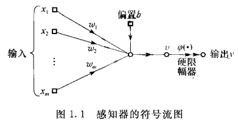
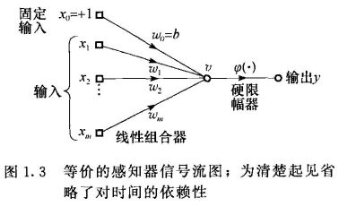

# 1 引言

形成阶段： 

- McCulloch and Pitts(1943)，引入神经网络地概念作为计算工具 
- Hebb(1949)提出自组织学习的第一个规则 
- Rosenblatt(1958)提出感知器作为监督学习的第一个模型 

# 2 感知器

Rosenblatt感知器建立在一个非线性神经元上，即神经元的McCulloch-Pitts模型。 

# 3 感知器收敛定理

(m+1)X1输入向量：
$$
\bold{x}(n) = [+1, x_1(n), x_2(n), ...,x_m(n)]^T
$$
n表示使用算法时的迭代步数。权值向量：
$$
\bold{w}(n)=[b,w_1(n),w_2(n),...,w_m(n)]^T
$$
线性组合器：
$$
v(n)=\sum_{i=0}^m w_i(n)x_i(n) = \bold{w}^T(n)\bold{x}(n)
$$

使基本感知器的权值向量自适应的算法：

1. 假如训练集合的第n个成员$\bold{x}(n)$根据算法中的第n次迭代的权值向量$\bold{w}(n)$能正确分类，那么感知器的权值向量按下述规则不做修改：
   $$
   \bold{w}(n+1) = \bold{w}(n) 假如\bold{w}^T\bold{x}(n) > 0 且\bold{x}(n)属于类1 \\
   \bold{w}(n+1) = \bold{w}(n) 假如\bold{w}^T\bold{x}(n) \le 0 且\bold{x}(n)属于类2
   $$

2. 否则，感知器的权值向量根据以下规则进行修改：
   $$
   \bold{w}(n+1)=\bold{w}(n) - \mu(n)\bold{x}(n) \space \space 假如\bold{w}^T(n)\bold{x}(n)>0且\bold{x}(n)属于类2 \\
   \bold{w}(n+1)=\bold{w}(n) + \mu(n)\bold{x}(n) \space \space 假如\bold{w}^T(n)\bold{x}(n)<0且\bold{x}(n)属于类1
   $$

感知器收敛定理：对所有的$n,\mu(n)=1,$且$\bold{w}(0)=0$，如果解向量$\bold{w}_o$存在，那么感知器权值的适应过程最多再$n_{max}$次迭代后终止。